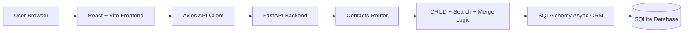
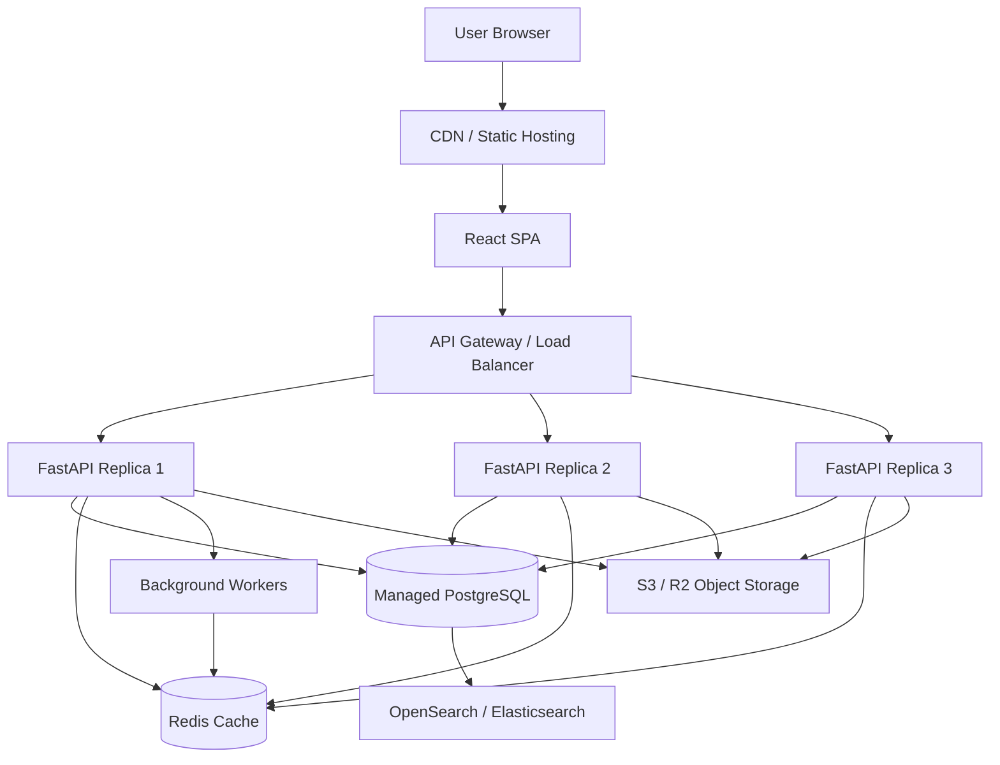

# ContactBook

ContactBook is a small but complete personal contact book application. It lets a user create, search, update, delete, and merge contacts from a clean web interface backed by a FastAPI REST API.

The project is intentionally built as a practical full-stack application rather than just a UI mockup. The backend owns validation, persistence, search, and merge behavior. The frontend focuses on a simple contact management workflow that feels quick for everyday use.

## What the Application Does

- Add contacts with first name, required phone number, optional email, company, address, and notes
- Edit existing contact details
- Search contacts by name, email, or phone number (phone numbers are normalised on save, so `999-999-9999` and `9999999999` match the same record)
- Delete contacts with a confirmation step
- Merge duplicate contacts
- Expose REST APIs with automatic Swagger documentation
- Run locally with Docker Compose or with separate backend/frontend dev servers

## Tech Stack

| Layer | Technology |
|---|---|
| Backend | FastAPI, Python 3.11+ |
| Database | SQLite |
| ORM | SQLAlchemy 2.0 async |
| Migrations | Alembic |
| Frontend | React 18, Vite |
| Styling | Tailwind CSS v3 |
| State Management | Zustand |
| HTTP Client | Axios |
| Testing | pytest, httpx AsyncClient, Vitest, React Testing Library |
| Deployment | Docker, Docker Compose, Nginx |

## Project Structure

```text
contact-book/
├── backend/
│   ├── app/
│   │   ├── main.py
│   │   ├── config.py
│   │   ├── database.py
│   │   ├── models.py
│   │   ├── schemas.py
│   │   ├── crud.py
│   │   └── routers/
│   │       └── contacts.py
│   ├── alembic/
│   ├── tests/
│   ├── .dockerignore
│   ├── requirements.txt
│   └── Dockerfile
├── frontend/
│   ├── src/
│   │   ├── api/
│   │   ├── store/
│   │   ├── components/
│   │   └── pages/
│   ├── .dockerignore
│   ├── package.json
│   └── Dockerfile
├── docs/
│   └── ARCHITECTURE.md
├── docker-compose.yml
├── .env.example
├── .github/workflows/ci.yml
└── README.md
```

## Local Architecture



The frontend talks to the backend through `/api/v1` endpoints. In development, Vite proxies API requests to FastAPI. In Docker, Nginx serves the built React app and forwards `/api` requests to the backend service.

## Quick Start with Docker

Docker is the easiest way to run the full application.

```bash
docker compose up --build
```

Open the application at:

```text
http://localhost:3000
```

The backend API runs at:

```text
http://localhost:8000
```

Swagger API documentation is available at:

```text
http://localhost:8000/docs
```

The Docker build contexts are trimmed with `.dockerignore` files so local virtual environments, SQLite files, `node_modules`, and Vite build output are not copied into images.

## Local Development without Docker

### Backend

```bash
cd backend
python -m venv .venv
source .venv/bin/activate
pip install -r requirements.txt
uvicorn app.main:app --reload
```

To enable verbose SQLAlchemy query logging during development, set the `APP_DEBUG` environment variable:

```bash
APP_DEBUG=true uvicorn app.main:app --reload
```

Backend URLs:

```text
API: http://localhost:8000
Docs: http://localhost:8000/docs
Health: http://localhost:8000/health
```

### Frontend

```bash
cd frontend
npm install
npm run dev
```

Frontend URL:

```text
http://localhost:5173
```

If the backend is running on a different port, start Vite with:

```bash
VITE_API_PROXY_TARGET=http://localhost:8010 npm run dev
```

## Running Tests

Backend:

```bash
cd backend
pytest tests/ -v
```

Frontend:

```bash
cd frontend
npm test
npm run build
```

The backend tests cover contact creation, listing, search by name/email/phone, update, delete, merge behavior, merge overrides, invalid email rejection, required phone validation, alphabetic phone rejection, phone normalization, blank optional field normalization, and blank first name rejection.

The frontend tests cover form validation, required phone behavior, phone digit filtering, successful form submission, loading skeletons, empty state behavior, API error display, and the merge flow with optional duplicate-value overrides.

## Continuous Integration

The repository includes a GitHub Actions workflow at `.github/workflows/ci.yml`.

On every push to `main` and every pull request, CI runs:

- Backend dependency install and `pytest tests/ -v`
- Frontend dependency install with `npm ci`
- Frontend tests with `npm test`
- Frontend production build with `npm run build`

## API Endpoints

| Method | Endpoint | Purpose |
|---|---|---|
| `GET` | `/health` | Health check |
| `GET` | `/api/v1/contacts/` | List contacts |
| `POST` | `/api/v1/contacts/` | Create a contact |
| `GET` | `/api/v1/contacts/search?q=alice` | Search contacts |
| `GET` | `/api/v1/contacts/{contact_id}` | Get one contact |
| `PUT` | `/api/v1/contacts/{contact_id}` | Update a contact |
| `DELETE` | `/api/v1/contacts/{contact_id}` | Delete a contact |
| `POST` | `/api/v1/contacts/merge` | Merge two contacts |

## How Merge Contact Works

The merge feature is meant for duplicate contacts.

For example, you may have one contact named `Amit Sharma` with only an email address, and another `Amit Sharma` with only a phone number. Instead of keeping both records, you can merge one into the other.

The app uses a conservative merge strategy:

- The selected target contact remains
- The selected source contact is deleted
- Existing fields on the target contact are kept
- Empty fields on the target are filled from the source contact
- If both contacts have different values, the modal keeps the UI simple by hiding those choices behind `Review different details`; the user can then choose specific duplicate values as overrides

This avoids accidentally overwriting useful information. In simple terms, the target contact wins, and the source contact only fills missing details.

## Deployment Notes

The included Docker setup has two services:

- `backend`: FastAPI app running with Uvicorn
- `frontend`: React app built with Vite and served through Nginx

Docker Compose also creates a persistent volume for the SQLite database.

```bash
docker compose up --build
```

For a small personal application, this setup is enough. For a public application used by many people, I would change the architecture as described below.

## Web-Scale Deployment Architecture

Question: If this application is to be deployed as a web application for wider use, what changes would you make and what would be your architecture?

For wider use, I would not run this as a single container with SQLite. SQLite is excellent for local development and small personal tools, but a public web application needs stronger concurrency, user isolation, backups, observability, and horizontal scaling.

The main change would be to make the backend stateless and move durable state into managed services. The React frontend would be served from a CDN. The FastAPI backend would run as multiple replicas behind a load balancer. SQLite would be replaced with PostgreSQL. Redis would be added for caching, rate limiting, and background jobs. Search could start in PostgreSQL and later move to OpenSearch if fuzzy search becomes important.



### Changes I Would Make

#### 1. Replace SQLite With PostgreSQL

SQLite is file-based, so it is not ideal when multiple backend replicas are writing at the same time. I would move the database to managed PostgreSQL through AWS RDS, Supabase, Neon, or a similar service.

PostgreSQL would give the application:

- Better concurrent writes
- Automated backups
- Point-in-time recovery
- Read replicas when traffic grows
- Strong indexing for search
- A path to row-level security for multi-user data

#### 2. Add Authentication And User Ownership

The current app is a personal contact book. For public use, contacts must belong to users.

I would add:

- OAuth2 or OpenID Connect login using Auth0, Clerk, Cognito, or a self-hosted provider
- JWT-based API authentication
- A `user_id` column on the contacts table
- Database indexes such as `(user_id, first_name)` and `(user_id, email)`
- Strict backend checks so users can access only their own contacts

#### 3. Run Multiple FastAPI Replicas

The backend should be stateless. That means no local disk dependency for user data and no in-memory session state.

I would run at least two or three FastAPI containers behind a load balancer using ECS, Kubernetes, Render, Railway, Fly.io, or another container platform. This makes deployments safer and allows the app to handle more traffic by adding more replicas.

#### 4. Add Redis

Redis would be useful for:

- Caching repeated contact list and search requests
- Rate limiting API calls
- Storing background job state
- Short-lived application coordination

For example, search results could be cached for a short time and invalidated whenever a contact is created, updated, deleted, or merged.

#### 5. Improve Search

At first, I would use PostgreSQL indexes and `pg_trgm` for better name, email, and phone search. If the product later needs typo tolerance, ranking, advanced filters, or very large datasets, I would introduce OpenSearch or Elasticsearch.

Phone numbers should also be normalized before saving so searches are consistent even when users type numbers with spaces, country codes, or dashes.

#### 6. Add Background Workers

Some tasks should not block API requests. I would add background workers for:

- CSV imports and exports
- vCard imports
- Duplicate contact detection
- Email or phone verification
- Search index synchronization

Celery, RQ, or ARQ with Redis would be enough for this stage.

#### 7. Store Files Outside The App Container

If contacts later support avatar images or attachments, those files should go to S3, Cloudflare R2, or another object storage service. The database should store file metadata and object keys, not the files themselves.

#### 8. Add Observability

For a real deployment, I would add:

- Structured JSON logs
- Request IDs
- Error tracking with Sentry
- Metrics for request count, latency, and error rate
- Database performance monitoring
- Alerts for high error rates or slow responses

This is important because once real users depend on the app, debugging only through container logs is not enough.

#### 9. Add CI/CD

I would use GitHub Actions to run tests and build checks on every pull request.

A production pipeline would look like:

```text
Pull Request -> tests -> build frontend -> build backend image -> deploy preview
Main Branch -> tests -> build -> push image -> run migrations -> rolling deploy
```

Database migrations should run as a controlled deployment step, not manually from a developer machine.

## Production Data Model Changes

For public use, the contact model should include ownership and operational fields:

```text
contacts
- id
- user_id
- first_name
- last_name
- email
- normalized_email
- phone
- normalized_phone
- address
- company
- notes
- created_at
- updated_at
- deleted_at
```

Important indexes:

```text
(user_id, first_name)
(user_id, email)
(user_id, normalized_phone)
```

## Estimated Production Cost

For a modest deployment with around 1000 daily active users, a basic cloud setup could stay reasonably small.

| Component | Estimated Monthly Cost |
|---|---:|
| Managed PostgreSQL | $25-$40 |
| Backend containers | $15-$40 |
| Redis | $15-$20 |
| CDN and static hosting | $5-$15 |
| Logs and monitoring | $5-$20 |
| Total | ~$65-$135 |

The exact cost depends on the cloud provider and traffic pattern, but the important point is that the architecture can start small and grow gradually.

## Why This Architecture

This architecture keeps the simple parts simple and scales only the parts that need it.

The frontend can be cached globally because it is static. The backend can scale horizontally because it is stateless. PostgreSQL becomes the source of truth. Redis handles fast temporary data. Background workers handle slow jobs. Observability and CI/CD make the system maintainable once real users are using it.

For the current assignment, SQLite and Docker Compose are the right level of complexity. For wider public use, the production architecture above is the path I would take.
